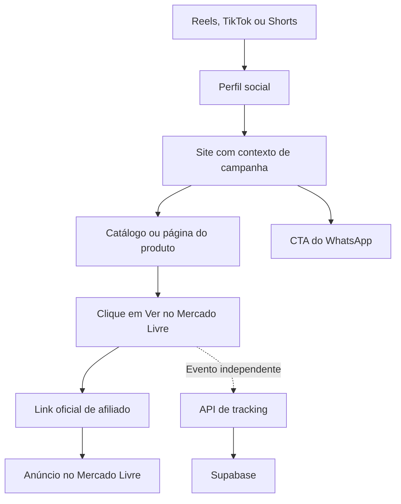

**Recomendo uma V1 com Next.js + Supabase, catálogo com cache, links de afiliado versionados e tracking separado da navegação. A descoberta que muda o desenho é a cláusula 1.8 do Mercado Livre: ela restringe encurtamento e modificação dos links. Por isso, `/go/[slug]` não deve ser o caminho padrão sem autorização específica.** [Termos oficiais](https://www.mercadolivre.com.br/ajuda/30228).

Abaixo está o brainstorming completo, com inspeção realizada em **07/10/2026**. Tudo apresentado como arquitetura é proposta; nenhuma implementação foi executada.

# 1. ESTADO ATUAL

## Identidades verificadas

| Recurso | Encontrado no ambiente |
|---|---|
| Organização Supabase | `bernardofariasilva14@gmail.com's Org` |
| ID da organização | `jwldvpgfkutrqisimgzr` |
| Plano da organização | Free |
| Projeto Supabase | `CaiaoOficina` |
| ID do projeto | `lyhybytsfbdiodtsytqc` |
| Região | `sa-east-1` |
| Estado | `ACTIVE_HEALTHY` |
| PostgreSQL | `17.11.0.003` |
| Repositório GitHub | [bfsiatools/CaiaoOficina](https://github.com/bfsiatools/CaiaoOficina) |
| ID do repositório | `1409174704` |
| Visibilidade | Público |

Os nomes reais diferem dos nomes descritivos do briefing. Nenhum recurso foi renomeado.

## Repositório e pasta local

A pasta [CAIAODAOFICINA](C:/Users/berna/OneDrive/Desktop/CAIAODAOFICINA) está vazia e não contém `.git`.

O GitHub confirmou que o repositório também está vazio: não há arquivos nem commits. Portanto, ainda não existem frontend, dependências, helpers, tipos gerados, configurações ou arquivos Supabase para reaproveitar.

**O vínculo operacional GitHub ↔ Supabase não foi confirmado.** Os recursos existem, mas isso não demonstra que publicação automática de migrations esteja configurada.

## Auditoria do Supabase

| Área | Resultado observado |
|---|---|
| Schemas | `auth`, `extensions`, `graphql`, `graphql_public`, `public`, `realtime`, `storage`, `vault` |
| Tabelas de negócio em `public` | Nenhuma |
| Relacionamentos de negócio | Nenhum |
| Migrations do projeto | Nenhuma listada |
| Policies | Nenhuma encontrada |
| Triggers de tabelas em `public` | Nenhum |
| Funções em `public` | `rls_auto_enable()` |
| Edge Functions | Nenhuma |
| Storage buckets | Nenhum |
| Objetos no Storage | Nenhum |
| Usuários no Auth | Zero |
| Identidades de autenticação | Zero |
| Performance Advisor | Nenhum aviso |
| Security Advisor | Dois avisos relacionados à mesma função |

Extensões instaladas: `plpgsql`, `pg_stat_statements`, `uuid-ossp`, `pgcrypto` e `supabase_vault`. `pg_cron`, `pg_net`, `pgmq` e `vector` não estão instaladas.

A função `rls_auto_enable()` é `SECURITY DEFINER`, retorna `event_trigger` e está associada ao event trigger `ensure_rls`. Seu corpo habilita RLS em novas tabelas de `public`.

Confirmei que `anon` e `authenticated` possuem permissão `EXECUTE`, origem dos avisos:

- [Advisor 0028](https://supabase.com/docs/guides/database/database-linter?lint=0028_anon_security_definer_function_executable).
- [Advisor 0029](https://supabase.com/docs/guides/database/database-linter?lint=0029_authenticated_security_definer_function_executable).

**Isso não comprova uma RPC explorável.** Uma função `event_trigger` depende do contexto de execução de eventos DDL; os próprios testes do PostgreSQL verificam que sua chamada como função comum deve falhar. Recomendo revisar os grants na etapa de segurança, preservando o mecanismo automático de RLS. [Teste oficial do PostgreSQL](https://github.com/postgres/postgres/blob/master/src/test/regress/sql/event_trigger.sql).

Configurações de OAuth, SMTP, cadastro público, URLs de Auth e integração GitHub ficaram **não verificadas**: o MCP não expõe essas configurações e o Dashboard solicitou login.

**Reaproveitamento disponível:** infraestrutura Supabase provisionada e repositório criado. Ainda não há arquitetura de aplicação existente.

# 2. VISÃO DO SISTEMA

O Caião da Oficina será uma vitrine editorial de produtos úteis. Sua função é conectar conteúdo social a recomendações e permitir descobrir quais produtos despertam interesse.

O sistema precisa sustentar três atividades:

1. Publicar e atualizar um catálogo pequeno.
2. Encaminhar voluntariamente o visitante ao anúncio correto.
3. Registrar interesse suficiente para orientar o próximo conteúdo.

Você confirmou que vai operar pelo computador com apoio dos agentes. Isso favorece **Dashboard + scripts**, sem exigir painel próprio na V1.

Considero sucesso inicial:

- Produtos publicados com informação revisada e link válido.
- Alterações simples de nome, imagem, categoria, destaque e status.
- Navegação rápida, inclusive quando o tracking falhar.
- Relatórios básicos por produto, origem e período.
- Vendas e comissões acompanhadas no Mercado Livre.

Cliques medem interesse. A validação financeira depende das vendas e comissões reconhecidas pelo programa.

# 3. FLUXO DO USUÁRIO



A página do produto é opcional: o card pode oferecer acesso direto ao Mercado Livre. Não recomendo obrigar uma etapa adicional quando ela não acrescenta informação.

Há dois fluxos diferentes:

- **Link genérico da bio:** identifica a plataforma quando marcado, mas geralmente não identifica o vídeo assistido.
- **Link específico de conteúdo:** pode carregar `content_id` e campanha até o clique no produto.

Não devemos atribuir uma visita da bio ao vídeo mais recente por suposição.

# 4. ARQUITETURA RECOMENDADA

| Camada | Responsabilidade |
|---|---|
| Next.js App Router + TypeScript | Renderização, contrato de dados e endpoints |
| Server Components | Consultar o catálogo e entregar HTML |
| Client Components pequenos | Filtros interativos e captura dos cliques |
| Supabase PostgreSQL | Catálogo, categorias, versões dos links e eventos |
| Supabase Storage | Imagens com origem e autorização verificadas |
| CDN/cache | Servir páginas e catálogo com poucas consultas |
| API de tracking | Validar eventos e gravá-los com credencial de servidor |

**Next.js é uma recomendação de stack**, pois o repositório ainda não possui framework definido.

## Backend

Um único projeto Next.js comporta a V1. Não recomendo backend separado, microserviços ou Edge Function adicional para repetir a mesma lógica.

O catálogo terá uma camada de acesso no servidor e um DTO público próprio. O frontend não deve depender diretamente do formato das tabelas.

## Navegação externa

O botão terá como `href` o link oficial aprovado, preservado como recebido. A captura do clique ocorrerá separadamente.

Isso permite abrir o anúncio mesmo com JavaScript desativado ou falha na API de eventos. Nessas situações, o clique pode não ser registrado — limitação aceita e documentada.

## Administração

- Dashboard: ajustes editoriais cotidianos.
- Script: importação com prévia, validação e relatório.
- Operação específica: troca de link com preservação do histórico.
- Sem autenticação de visitantes na V1.

# 5. MODELAGEM DE DADOS PROPOSTA

Recomendo **seis tabelas pequenas**, cada uma com responsabilidade clara.

## `products`

Representa a identidade editorial do produto, independente do anúncio usado hoje.

| Campo | Tipo | Regra |
|---|---|---|
| `id` | `uuid` | PK estável |
| `import_key` | `text` | Única e imutável para reimportação |
| `slug` | `text` | Único; não muda ao renomear |
| `name` | `text` | Obrigatório |
| `short_description` | `text` | Pode faltar durante preparação |
| `image_path` | `text` | Caminho no Storage |
| `image_alt` | `text` | Descrição acessível |
| `status` | `text` com CHECK | Estados abaixo |
| `sort_order` | `integer` | Ordenação geral |
| `featured_rank` | `integer`, nullable | `null` significa sem destaque |
| `daily_pick_date` | `date`, nullable | Data editorial do achado |
| `daily_pick_rank` | `integer` | Ordem entre achados |
| `created_at` | `timestamptz` | Criação |
| `updated_at` | `timestamptz` | Última alteração |

Estados propostos:

| Estado | Significado |
|---|---|
| `active` | Publicado e disponível no catálogo |
| `inactive` | Em preparação ou temporariamente oculto |
| `out_of_stock` | Indisponibilidade verificada manualmente |
| `archived` | Retirado da operação, com histórico preservado |

A importação inicial entra como `inactive`. Para ativar, exigimos descrição, imagem, categoria e link vigente revisados.

**O catálogo público só entrega produtos `active`.** Os demais ficam acessíveis na administração. O site não deve expor rascunhos para permitir sua gestão.

## `categories`

| Campo | Tipo |
|---|---|
| `id` | `uuid`, PK |
| `slug` | `text`, UNIQUE |
| `name` | `text` |
| `sort_order` | `integer` |
| `is_active` | `boolean` |

Taxonomia inicial recomendada:

- Ferramentas e reparos.
- Automotivo.
- Casa e organização.
- Limpeza e cuidados.

“Gadgets” descreve um estilo de produto e tende a virar categoria genérica. Recomendo adicioná-la somente se a lista real revelar um conjunto coerente que não caiba nas categorias acima.

## `product_categories`

| Campo | Tipo |
|---|---|
| `product_id` | `uuid`, FK → `products` |
| `category_id` | `uuid`, FK → `categories` |

PK composta: `(product_id, category_id)`.

**Recomendo many-to-many.** Um compressor pode aparecer em Automotivo e Ferramentas sem duplicar o produto. O custo adicional é uma tabela de associação simples; evita uma migração previsível.

## `affiliate_links`

Cada registro representa uma versão do destino.

| Campo | Tipo | Regra |
|---|---|---|
| `id` | `uuid` | PK |
| `product_id` | `uuid` | FK → `products` |
| `marketplace` | `text` com CHECK | Mercado Livre na V1 |
| `affiliate_url` | `text` | URL original, sem reconstrução |
| `marketplace_item_id` | `text`, nullable | ID do anúncio, quando confirmado |
| `marketplace_catalog_id` | `text`, nullable | ID de catálogo, quando confirmado |
| `seller_id` | `text`, nullable | Apenas se houver informação confiável |
| `created_at` | `timestamptz` | Início da versão |
| `ended_at` | `timestamptz`, nullable | `null` identifica a versão vigente |

Índice único parcial em `product_id` onde `ended_at IS NULL`: no máximo um link vigente por produto.

**Por que separar agora?** O briefing exige trocar anúncio ou vendedor preservando histórico. Uma tabela de versões atende esse requisito diretamente; não é infraestrutura para múltiplas lojas.

Na troca:

1. Bloquear a alteração concorrente daquele produto.
2. Encerrar a versão atual.
3. Criar a nova versão.
4. Confirmar tudo na mesma transação.

Duas chamadas HTTP independentes de update e insert não oferecem essa atomicidade. A operação futura deve ser restrita ao servidor/script.

URLs antigas ficam imutáveis. Se o novo anúncio representar outro produto ou variante materialmente diferente, deve nascer outra identidade editorial.

## `click_events`

| Campo | Tipo | Origem |
|---|---|---|
| `event_id` | `uuid`, PK | Identidade da ação e deduplicação |
| `schema_version` | `smallint` | Versão do contrato |
| `event_type` | `text` com CHECK | `product_click` ou `whatsapp_click` |
| `received_at` | `timestamptz` | Relógio do servidor |
| `product_id` | `uuid`, nullable | Obrigatório em clique de produto |
| `affiliate_link_id` | `uuid`, nullable | Versão efetivamente apresentada |
| `category_snapshot` | `jsonb` | Categorias no momento do evento |
| `page_path` | `text` | Caminho interno normalizado |
| `placement` | `text` | Card, destaque, achado, página etc. |
| `cta_id` | `text` | Identificador estável do CTA |
| `utm_source` | `text`, nullable | Contexto informado |
| `utm_medium` | `text`, nullable | Contexto informado |
| `utm_campaign` | `text`, nullable | Contexto informado |
| `utm_content` | `text`, nullable | Contexto informado |
| `content_id` | `text`, nullable | Identidade interna do conteúdo |
| `referrer_host` | `text`, nullable | Somente hostname |
| `attribution_method` | `text` | UTM, referrer ou desconhecida |
| `quality` | `text` | Aceito ou suspeito |

A categoria fica congelada no evento para não reclassificar cliques antigos quando o catálogo mudar.

Uma FK composta deve impedir associar o link do produto A ao produto B. Exclusões físicas de produtos e versões referenciados por eventos devem ser bloqueadas.

Não armazenaria IP bruto, user-agent completo ou identificador persistente de visitante na V1.

## `site_settings`

Uma única linha, com chave fixa e CHECK correspondente:

- `id`: `smallint`, valor `1`.
- `whatsapp_url`: `text`, nullable.
- `whatsapp_enabled`: `boolean`.
- `updated_at`: `timestamptz`.

Essa tabela contém apenas configurações públicas. Credenciais nunca entram nela.

## Índices iniciais

Além das PKs e unicidades:

- `product_categories(category_id, product_id)`.
- `affiliate_links(product_id, created_at DESC)`.
- `click_events(received_at)`.
- `click_events(product_id, received_at)`.
- `click_events(content_id, received_at)`.

Não criaria índices para todas as UTMs. Com 50 produtos, otimização do catálogo deve priorizar consultas simples e cache.

## O que fica fora do schema inicial

- `content` e `social_posts`: `content_id` textual basta inicialmente.
- `campaigns`: nomes padronizados nas UTMs.
- `collections`: destaques e achados têm campos específicos.
- Histórico completo de cada edição editorial.
- Tabelas de preço, estoque, comissão e pedidos.

# 6. ALTERNATIVAS CONSIDERADAS

## Caminho de saída para o Mercado Livre

| Alternativa | Vantagem | Limitação | Recomendação |
|---|---|---|---|
| Link oficial direto + evento separado | Menor latência; navegação independente do tracking | Perda parcial de eventos | **V1 recomendada** |
| `/go/[slug]` + registro no servidor | Destino centralizado; mede requisições ao redirect | Mais dependência operacional, bots e risco contratual | Somente com autorização específica |
| Links diretos + métricas apenas do Mercado Livre | Menor implementação | Menos informação sobre posição e contexto no site | Alternativa se rapidez de lançamento prevalecer |

Li os termos completos no navegador. A cláusula **1.8** restringe serviços de corte e modificação dos links; a **1.3** exige mídias informadas ao programa; a **4.3(c)** restringe extração automatizada de dados. Minha interpretação técnica é que um redirect próprio exige confirmação específica, e scraping não deve fazer parte da importação. [Termos oficiais](https://www.mercadolivre.com.br/ajuda/30228).

## Caso `/go` seja autorizado futuramente

Seu desenho deveria ter:

- Destino obtido exclusivamente do registro confiável.
- Redirect temporário, como `302`.
- Resposta `Cache-Control: no-store`.
- Nenhuma alteração dos parâmetros de afiliado.
- Slug inexistente ou produto desativado sem saída externa.
- Nenhum evento para `HEAD` ou prefetch identificado.
- Falha no tracking sem impedir um redirect válido.
- Erro de resolução do destino sem aceitar URL fornecida pelo visitante.

Um redirect permanente ou armazenado na CDN pode manter destinos antigos e fazer requisições futuras escaparem do tracking.

Para tracking após a resposta, `after()` é uma opção quando o runtime suporta a continuidade da execução. Ele possui limite de duração e não equivale a fila durável. Uma Promise abandonada após responder não é solução confiável. [Documentação de `after()`](https://nextjs.org/docs/app/api-reference/functions/after).

## Local de execução

| Opção | Avaliação |
|---|---|
| Next.js Route Handler | Recomendada: uma aplicação e um deploy |
| Supabase Edge Function | Viável se o frontend for estático ou houver outros consumidores independentes |
| RPC PostgreSQL | Adequada para transações internas; não substitui endpoint HTTP de navegação |
| Supabase direto do navegador | Adequado para leitura pública protegida; inadequado para insert irrestrito de eventos |

# 7. SISTEMA DE TRACKING

## O que um evento significa

Na arquitetura recomendada, `product_click` significa:

> Uma ação observada no site sobre o CTA de um produto, recebida e validada pelo backend.

Não significa pessoa única, anúncio carregado, compra ou comissão.

## Captura

O frontend utiliza um link HTML normal e tenta enviar um evento independente por `sendBeacon` ou `fetch` com `keepalive`.

Regras:

- Não aguardar o tracking para navegar.
- Não substituir o link por JavaScript obrigatório.
- Tratar clique por teclado e abertura em nova aba.
- Evitar dois eventos para a mesma ação.
- Não contar renderização, hover ou prefetch como clique.
- Não gerar visitas ao Mercado Livre para “testar” tracking.

Cliques com JavaScript desativado, bloqueadores ou algumas ações do menu de contexto podem ficar sem evento.

## Deduplicação

O mesmo `event_id` acompanha tentativas repetidas de enviar uma ação. A PK impede contagem duplicada desse envio.

**Isso não deduplica pessoas e não impede um atacante de gerar novos IDs.**

## Atribuição

Exemplo de entrada:

```text
/?utm_source=instagram
 &utm_medium=organic_social
 &utm_campaign=oficina-outubro
 &utm_content=compressor-demonstracao
 &content_id=video-007
```

Esses parâmetros pertencem ao site. Não devem ser anexados automaticamente ao link oficial de afiliado.

O contexto acompanha a navegação interna e chega ao evento. Para a V1, pode permanecer na URL e no estado da página, sem cookie de analytics.

Prioridade:

1. UTM explícita e válida.
2. Referrer reconhecido, quando disponível.
3. Origem desconhecida.

Ausência de referrer não comprova tráfego direto. UTMs também são informações declaradas pelo emissor, não prova independente da origem.

## Identidade de conteúdo

Recomendo `content_id` interno, como `video-007`, em vez de depender inicialmente de IDs diferentes das plataformas.

O mesmo conteúdo publicado em três redes pode compartilhar `content_id`; `utm_source` diferencia a distribuição.

**Limite fundamental:** um link fixo na bio não revela qual vídeo motivou cada visita. Atribuição por vídeo exige link específico, entrada identificada ou escolha explícita do visitante.

## Métricas e prioridades

| Prioridade | Entrega |
|---|---|
| MUST HAVE | Cliques recebidos por produto, dia, plataforma, versão do link e posição do CTA |
| MUST HAVE | UTMs e `content_id` quando presentes; origem desconhecida preservada |
| SHOULD HAVE | Categorias históricas, exportação CSV, análise por horário e marcação de eventos suspeitos |
| NICE TO HAVE | Ranking semanal, tendências com volume mínimo e importação de dados externos |
| NOT NOW | Pessoas únicas, atribuição entre dispositivos e atribuição automática de vendas |

Datas ficam em UTC; relatórios editoriais usam `America/Sao_Paulo`.

Produtos com várias categorias aparecem em várias análises. Portanto, **a soma dos cliques por categoria pode superar o total geral**.

## CTR e conversão

Para CTR do card:

```text
cliques observados no card / impressões medidas do card
```

Para relação entre conteúdo social e saída:

```text
cliques atribuídos ao conteúdo / visualizações desse conteúdo
```

A segunda métrica deve ter nome próprio e limitações explícitas: períodos precisam coincidir, visualizações podem ser repetidas e a atribuição pode ser incompleta.

Sem medir impressões, não apresentar CTR do site. Sem relatório do Mercado Livre, não apresentar conversão em vendas.

# 8. ESTRATÉGIA DE IMPORTAÇÃO DOS 50 PRODUTOS

**Recomendo parser de TXT → prévia validada → enriquecimento revisado → importação controlada.**

O arquivo com os 50 produtos ainda não foi fornecido; a análise atual considera o formato descrito.

## Primeira leitura

O parser futuro deve:

- Aceitar UTF-8, BOM e CRLF/LF.
- Ignorar linhas vazias.
- Separar nome e URL pelo delimitador definido.
- Validar nome, protocolo HTTPS e hostname.
- Detectar duplicatas dentro do arquivo.
- Relatar erros com número da linha.
- Preservar a URL original de afiliado.
- Não abrir links nem consultar páginas de produto durante o parsing.

A prévia separa registros novos, repetidos, inválidos e ambíguos antes de qualquer gravação.

## Enriquecimento

`Nome | URL` não fornece imagem, descrição, categoria nem disponibilidade confiável.

Recomendo um arquivo estruturado intermediário com:

- ID/import key.
- Nome revisado.
- Slug.
- Descrição.
- Categorias.
- Imagem autorizada.
- Link oficial.
- Estado inicial.

IA pode sugerir texto e categorias. Especificações técnicas e atributos precisam de revisão, especialmente nos produtos apresentados pelo personagem.

## Deduplicação

| Identificador | Uso |
|---|---|
| UUID/import key estável | Identidade definitiva |
| URL original idêntica | Detectar repetição da primeira carga |
| Nome normalizado | Sinalizar possível duplicata |
| Slug | Identidade de navegação |
| ID de anúncio confirmado | Auxiliar a revisão |
| ID de catálogo | Auxiliar; não prova equivalência entre ofertas e variantes |

Na primeira carga, uma impressão digital da URL original pode formar a `import_key`, que permanece imutável. O manifest enriquecido passa a transportar essa chave nas próximas importações.

Quando a URL mudar em um TXT sem identidade estável, o sistema deve pedir associação/revisão. **Não deve fundir produtos apenas porque seus nomes se parecem.**

IDs de anúncio, catálogo e variantes não devem ser tratados como intercambiáveis. Links curtos oficiais podem não revelar nenhum deles; campos nullable são melhores que uma extração inventada.

## Reimportação

- Modo de prévia como padrão.
- Sem exclusão automática dos produtos ausentes.
- Sem apagar imagens ou descrições com valores vazios.
- Alterações somente nos campos explicitamente fornecidos.
- Troca de link criando versão.
- Escritas relacionadas executadas em transação.
- Relatório final de alterações.

Não recomendo seed como ferramenta cotidiana: seed reproduz uma base; importação precisa respeitar edições posteriores.

# 9. INTERFACE COM O FRONTEND

O Claude Code deve consumir um **contrato de catálogo**, sem conhecer credenciais privilegiadas ou regras de importação.

## Organização proposta

Caminhos futuros, ainda inexistentes:

| Caminho | Responsabilidade |
|---|---|
| `src/lib/catalog/server.ts` | Acesso ao catálogo, somente servidor |
| `src/lib/catalog/types.ts` | DTOs públicos |
| `src/lib/supabase/database.types.ts` | Tipos gerados do banco |
| `src/lib/tracking/client.ts` | Captura e envio |
| `src/lib/tracking/schema.ts` | Validação compartilhada |
| `src/app/api/events/route.ts` | Recepção de eventos |

Tipos gerados descrevem o banco. DTOs descrevem o que o frontend recebe; não devem ser a mesma coisa automaticamente.

## Helpers

| Helper | Retorno |
|---|---|
| `getCatalog()` | Produtos, categorias, destaques, achados e CTA público |
| `getProductBySlug(slug)` | Produto publicado ou `null` |
| `getProductsByCategory(slug)` | Lista filtrada do catálogo |
| `getFeaturedProducts()` | Seleção ordenada do catálogo |
| `getDailyPicks(date)` | Seleção editorial daquela data |

Os três últimos podem ser filtros sobre a mesma leitura com cache. Não precisam provocar cinco consultas independentes.

## DTO público

Um produto contém:

- `id`, `slug`, `name`, `shortDescription`.
- Imagem: URL, alt e dimensões quando conhecidas.
- Categorias: ID, slug e nome.
- Ordenação e posições editoriais.
- Oferta vigente: `affiliateLinkId`, `marketplace`, `affiliateUrl`.

**O link vigente é público por necessidade de navegação.** Ele não é uma credencial secreta.

Não enviar ao cliente:

- Secret key ou `service_role`.
- Credenciais do importador.
- Produtos ocultos.
- Histórico integral dos links.
- Eventos brutos.
- Informações internas de segurança ou administração.

## Contrato do tracking

O frontend envia somente:

- Identidade e tipo do evento.
- Produto e versão do link apresentados.
- Página, posição e CTA.
- Contexto de campanha permitido.

O servidor valida a associação produto/link, acrescenta horário e categorias e limita o tamanho dos campos. Não aceita uma URL arbitrária no payload.

Respostas propostas:

| Código | Significado |
|---|---|
| `204` | Evento aceito ou já recebido |
| `400` | Payload inválido |
| `429` | Limite de eventos excedido |
| `503` | Falha transitória de persistência |

Nenhuma dessas respostas deve impedir a navegação externa.

Um catálogo realmente vazio e uma consulta que falhou são estados distintos. O helper deve preservar essa diferença, sem transformar erro em lista vazia.

# 10. SEGURANÇA

## RLS e permissões

| Recurso | Acesso público proposto |
|---|---|
| Produtos | SELECT apenas de publicados, em colunas permitidas |
| Categorias | SELECT de categorias ativas |
| Associação de categorias | SELECT apenas dos vínculos públicos |
| Links | SELECT apenas da versão vigente de produto publicado |
| Eventos | Nenhum SELECT ou INSERT direto |
| Configuração pública | SELECT |
| Storage | Leitura das imagens públicas; escrita administrativa |

RLS limita linhas. Grants também precisam limitar operações e, quando necessário, colunas. Uma view pública deve respeitar as permissões do chamador, por exemplo com `security_invoker`. [Documentação de RLS](https://supabase.com/docs/guides/database/postgres/row-level-security).

## Keys

Publishable/anon key pode ser pública quando as permissões estiverem corretas. Secret key e `service_role` ficam exclusivamente no servidor; não entram em `NEXT_PUBLIC_*`, código cliente ou logs. [Documentação de API keys](https://supabase.com/docs/guides/getting-started/api-keys).

Como o repositório é público, exemplos de ambiente devem conter apenas placeholders.

## URLs

Na entrada administrativa:

- Exigir HTTPS.
- Validar hostname por correspondência explícita.
- Rejeitar credenciais embutidas, portas inesperadas e caracteres de controle.
- Não validar domínio com `includes`.
- Não utilizar encurtador genérico.
- Preservar os parâmetros oficiais após a validação.

A allowlist definitiva depende dos formatos oficiais encontrados na lista real.

Se `/go` existir no futuro, parâmetros como `url`, `next` ou `redirect_to` nunca poderão escolher seu destino.

## Spam e fraude

O endpoint de eventos é público e pode ser falsificado. RLS impede escrita direta no banco, mas não torna confiável todo pedido HTTP recebido.

Recomendo:

- Limite de tamanho do payload.
- Limite de frequência na camada de hospedagem.
- Validação dos IDs e campos.
- Deduplicação por evento.
- Verificação de origem como defesa adicional.
- Marcação de comportamento suspeito.
- Limite global para proteger o banco.

Rate limit apenas em memória não é global em ambiente serverless. `Origin` e user-agent também não provam humanidade.

Sem CAPTCHA em cada clique. Em abuso, a prioridade é restringir a telemetria e preservar o link de navegação.

## Privacidade e conteúdo

Proponho coleta mínima, aviso de privacidade e retenção inicial de **90 dias para eventos brutos**, com limpeza operacional definida. Não presumir que ausência de cookies elimina todas as obrigações de privacidade.

Os termos exigem identificação publicitária, restringem informações enganosas e proíbem apresentador simulado em Lives do Mercado Livre. Essa restrição específica não demonstra proibição geral de personagem virtual em vídeos sociais. O personagem não deve alegar teste pessoal inexistente. [Termos oficiais, cláusulas 1.5.1, 5 e 7](https://www.mercadolivre.com.br/ajuda/30228).

# 11. PERFORMANCE

## Catálogo

- Renderizar o conteúdo principal no servidor.
- Compartilhar uma leitura do catálogo.
- Cache explícito com atualização periódica.
- Proposta inicial: janela de atualização de até **60 segundos** em operação normal.
- Invalidação imediata quando a ferramenta administrativa suportar.
- Filtros locais para os 50 produtos.
- Ordenação determinística, com ID como desempate.

Dados de campanha do visitante devem ficar separados do cache compartilhado. A página com cache não pode incorporar a atribuição de outra pessoa.

## Imagens

Recomendo Supabase Storage para arquivos com uso autorizado:

- Caminhos versionados.
- Dimensões conhecidas.
- Tamanhos adequados.
- Lazy loading fora da área inicial.
- Fallback para imagem indisponível.

Hotlinking reduz controle sobre disponibilidade e desempenho. Copiar para o Storage resolve hospedagem, mas não concede direito de uso. A origem das imagens precisa ser definida antes de publicar.

## Tracking

A navegação direta não consulta o banco no momento do clique. A API de eventos faz validação e uma gravação pequena, sem ranking ou agregação pesada.

O relatório pode ser consultado depois por SQL administrativo ou exportação.

## Tráfego viral

“10.000 acessos” precisa de intervalo: por dia e por segundo são cargas completamente diferentes.

Esta proposta reduz o custo das leituras, mas não constitui prova de capacidade. Na execução, a homologação deve incluir rajadas, falha do tracking e consumo do banco.

O plano Free pode sofrer pausa por baixa atividade em uma janela de sete dias. Antes de campanha importante, disponibilidade e recuperação precisam ser verificadas. [Checklist de produção do Supabase](https://supabase.com/docs/guides/deployment/going-into-prod).

# 12. O QUE NÃO DEVEMOS CONSTRUIR AGORA

| Fora da V1 | Motivo |
|---|---|
| Painel administrativo próprio | Você opera pelo computador com agentes |
| Login de visitantes | Não serve ao fluxo principal |
| Carrinho, checkout ou pedidos | A compra ocorre no Mercado Livre |
| Controle próprio de estoque | Não somos o vendedor |
| Microserviços e backend separado | Acrescentam manutenção |
| Redis, filas e infraestrutura analítica dedicada | Sem necessidade comprovada |
| Realtime do catálogo | Atualização editorial não exige |
| Motor genérico de collections | Campos específicos atendem a V1 |
| Atualização automática de preço | Exige integração permitida e manutenção |
| Scraping de produtos | Restrição do programa e fragilidade operacional |
| Atribuição completa de vendas | Não há dados suficientes |
| Multiempresa e múltiplos personagens | Ainda não validados |
| Aplicativo próprio e sistema de recomendação por IA | Distantes do objetivo imediato |

Também não incluiria “Até R$100” sem uma fonte de preço confiável. “Achados de hoje” pode representar curadoria datada, sem afirmar desconto.

# 13. DÍVIDA TÉCNICA ACEITÁVEL

| Simplificação | Limite e condição de evolução |
|---|---|
| Dashboard para edição | Rever quando a operação ficar frequente ou difícil |
| `content_id` sem tabela própria | Evoluir ao importar dados de conteúdo |
| Tracking pelo navegador | Aceitar perda parcial; não chamar de contagem completa |
| Sem pessoas únicas | Acrescentar somente se houver necessidade e desenho de privacidade |
| Disponibilidade manual | Evoluir com integração oficialmente permitida |
| Sem preço no site | Evitar ofertas desatualizadas |
| Destaques e achados por campos | Migrar quando houver várias coleções independentes |
| Relatórios por SQL/CSV | Criar dashboard quando a consulta se tornar recorrente |
| Limpeza periódica por operação manual | Automatizar se a disciplina não se sustentar |

Você seria o responsável operacional pela revisão do catálogo e pela rotina de retenção, com apoio dos agentes.

Não considero dívida aceitável: credencial privilegiada no cliente, redirect arbitrário, perda silenciosa do histórico ou métricas de vendas inventadas a partir dos cliques.

# 14. EVOLUÇÃO FUTURA

| Necessidade comprovada | Evolução |
|---|---|
| Centenas de produtos | Paginação e busca com índices adequados |
| Várias lojas | Ofertas por produto, marketplace e programa |
| Links distintos por distribuição | Variações geradas pelas ferramentas oficiais |
| Muitos conteúdos | Tabelas de conteúdo e publicações por plataforma |
| Visualizações importadas | Métricas por publicação e período |
| Várias coleções | `collections` e associação com produtos |
| Operação por equipe/celular | Mini-admin com autenticação e papéis |
| Ranking confiável | Agregados, filtros de qualidade e volume mínimo |
| Grande volume de eventos | Retenção automatizada e agregação diária |
| Vários personagens | Identidade de marca e associação ao catálogo |

UUID estável de produto, histórico dos links e contrato público próprio permitem essas evoluções sem fazer o frontend depender do schema inicial.

Múltiplos personagens não devem ser traduzidos automaticamente em múltiplas contas de afiliado; os termos limitam a quantidade de contas por participante. [Termos oficiais, cláusula 1.2.1](https://www.mercadolivre.com.br/ajuda/30228).

# 15. RISCOS

| Nível | Risco | Tratamento recomendado |
|---|---|---|
| **CRÍTICO** | Usar redirect próprio incompatível com o programa | Link direto como padrão |
| **CRÍTICO** | Mídia/domínio não reconhecido pelo programa | Confirmar cadastro antes da divulgação |
| **CRÍTICO** | Exposição futura de secret key | Separação servidor/cliente e revisão do repositório |
| **ALTO** | Informação ou imagem sem uso autorizado | Revisão de origem e conteúdo |
| **ALTO** | Canal de WhatsApp incompatível | Confirmar modalidade pública e regras aplicáveis |
| **ALTO** | Métricas manipuladas por spam | Limites, validação e qualidade dos eventos |
| **ALTO** | Supabase indisponível ou sem capacidade para uma rajada | Cache, verificação pré-campanha e homologação |
| **MÉDIO** | Não conseguir identificar o vídeo de origem | Links específicos e origem desconhecida explícita |
| **MÉDIO** | Duplicação após troca de URL | Import key estável e revisão de ambiguidades |
| **MÉDIO** | Link desatualizado em página com cache | Atualização curta e versão registrada no evento |
| **MÉDIO** | Perda de eventos no navegador | Documentar e comparar tendências, sem prometer exatidão |
| **MÉDIO** | Avisos de grants em `rls_auto_enable` | Revisar na fase autorizada, sem remover proteção automática |
| **MÉDIO** | Desenvolvimento dentro do OneDrive | Aplicar a preferência registrada por código em `C:\dev` |
| **BAIXO** | Ordem de produtos instável | Desempate determinístico |
| **BAIXO** | Collections exigirem tabela futura | Migração pequena quando surgir necessidade |

Há divergência nas próprias páginas de orientação do Mercado Livre: uma admite WhatsApp público e restringe divulgação em buscas; outra lista WhatsApp/Telegram entre práticas proibidas. Não trataria a orientação favorável como garantia geral sem esclarecer a regra aplicável à conta. [Onde compartilhar](https://www.mercadolivre.com.br/l/afiliados-onde-compartilhar-links), [orientação divergente](https://www.mercadolivre.com.br/l/afiliados-aproveite-o-programa).

Por isso, **não recomendo SEO como canal de aquisição da V1 até esclarecer essa divergência**. Isso é diferente de manter HTML acessível e tecnicamente bem estruturado.

# 16. DECISÕES RECOMENDADAS

**DECISÃO 01 — Navegação externa**  
Problema: medir interesse preservando o fluxo e as regras do programa.  
Alternativas: redirect próprio, link direto com tracking ou apenas métricas oficiais.  
Recomendação: link direto oficial com tracking independente.  
Motivo: reduz latência e evita depender de autorização ainda não demonstrada para `/go`.

**DECISÃO 02 — Backend**  
Problema: oferecer dados tipados sem criar várias aplicações.  
Alternativas: Next.js integrado, backend separado ou Edge Functions.  
Recomendação: Next.js App Router + Supabase.  
Motivo: uma aplicação atende catálogo e eventos.

**DECISÃO 03 — Categorias**  
Problema: produtos pertencem a mais de um contexto.  
Alternativas: categoria única ou many-to-many.  
Recomendação: `categories` + `product_categories`.  
Motivo: evita duplicar produtos e atende casos já previstos.

**DECISÃO 04 — Histórico de links**  
Problema: trocar anúncio sem reescrever os cliques antigos.  
Alternativas: URL em produto, snapshot por evento ou versões separadas.  
Recomendação: `affiliate_links` versionada, com uma versão vigente.  
Motivo: preserva destino e associação histórica.

**DECISÃO 05 — Publicação**  
Problema: importar registros incompletos sem expor rascunhos.  
Alternativas: publicar tudo ou controlar estado.  
Recomendação: importação como `inactive` e ativação após revisão.  
Motivo: evita catálogo com informações ausentes.

**DECISÃO 06 — Curadoria**  
Problema: oferecer destaques e achados sem motor genérico.  
Alternativas: booleans, campos ordenados ou collections completas.  
Recomendação: `featured_rank` e achado com data e ordem.  
Motivo: atende o briefing com poucas regras.

**DECISÃO 07 — Importação**  
Problema: reaplicar TXT sem duplicar ou apagar edições.  
Alternativas: seed, cadastro manual ou importador idempotente.  
Recomendação: script com prévia e manifest de identidade estável.  
Motivo: torna mudanças explícitas e revisáveis.

**DECISÃO 08 — Administração**  
Problema: manter a operação simples.  
Alternativas: painel próprio, Dashboard ou arquivo como fonte exclusiva.  
Recomendação: Dashboard + scripts para operações específicas.  
Motivo: corresponde à forma de trabalho que você confirmou.

**DECISÃO 09 — Métricas**  
Problema: distinguir interesse, audiência e receita.  
Alternativas: juntar tudo em um indicador ou manter medidas separadas.  
Recomendação: cliques no site; audiência por fonte externa; receita pelo Mercado Livre.  
Motivo: evita conclusões que os dados não sustentam.

**DECISÃO 10 — Imagens e preços**  
Problema: apresentar produtos sem dados frágeis.  
Alternativas: hotlink, scraping ou material autorizado.  
Recomendação: imagens autorizadas no Storage; preço fora da V1.  
Motivo: melhora controle operacional e reduz desatualização.

**DECISÃO 11 — Contrato do frontend**  
Problema: permitir evolução do banco sem reescrever a UI.  
Alternativas: expor tabelas diretamente ou DTO próprio.  
Recomendação: helpers de servidor e DTO público independente.  
Motivo: define uma interface clara para o Claude Code.

**DECISÃO 12 — Privacidade e proteção do tracking**  
Problema: observar interesse sem ampliar coleta e exposição.  
Alternativas: identificação persistente ou eventos mínimos.  
Recomendação: eventos mínimos, sem IP bruto ou identidade persistente, com acesso administrativo e retenção definida.  
Motivo: atende as análises iniciais com menor custo e superfície de risco.

# 17. PERGUNTAS / BLOQUEIOS

**A única decisão necessária antes do plano é a aprovação ou ajuste desta proposta de V1**, principalmente:

> Adotar links oficiais diretos com tracking separado, aceitando que a contagem de cliques será parcial.

Não há necessidade de decidir painel próprio, multi-marketplace ou infraestrutura analítica agora.

Os itens abaixo são dependências para implementação/publicação, não impedimentos para preparar o plano:

| Dependência | Situação |
|---|---|
| Lista real dos 50 produtos | Ainda não fornecida |
| Imagens e origem autorizada | Ainda não definidas |
| Domínio e mídias cadastrados no programa | Não verificados |
| Modalidade e URL do WhatsApp | Ainda não definidas |
| Integração operacional GitHub ↔ Supabase | Não verificada |
| Configurações completas de Auth e deploy | Não verificadas |
| Local de desenvolvimento | Recomendo `C:\dev\CaiaoOficina`, conforme preferência registrada |

A investigação foi somente leitura. **Não alterei arquivos, código, banco, migrations, configurações ou commits.** Como o pedido atual proíbe modificar arquivos, também não gravei esta entrega no cofre. O brainstorming fica apresentado aqui para sua revisão; o plano de ação permanece para o próximo prompt.
